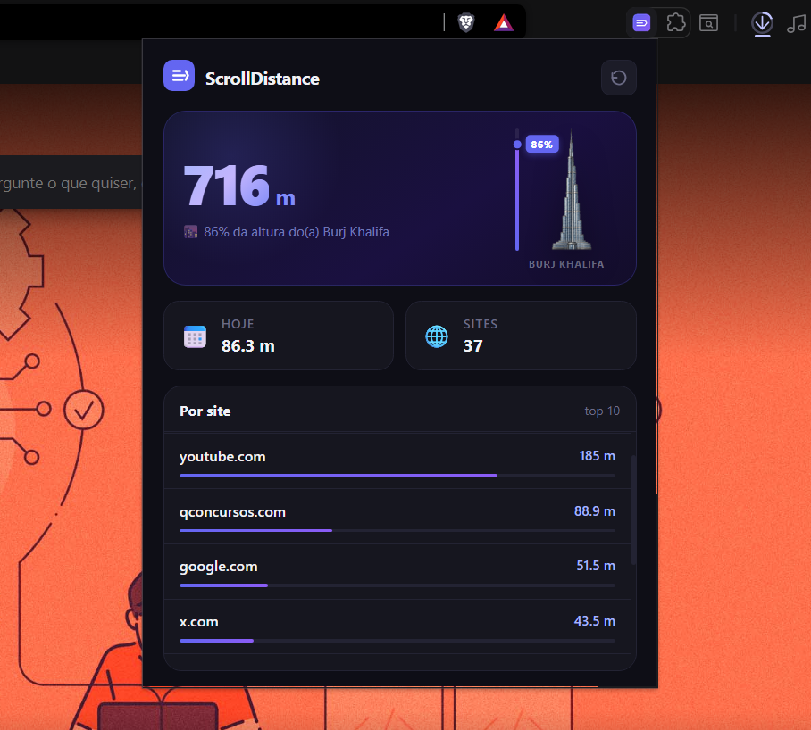

# ScrollDistance

Extensão para Chrome que transforma cada scroll em distância real — e compara com monumentos, montanhas e muito mais.



---

## Como funciona

A extensão monitora o scroll em **todas as abas** e acumula a distância percorrida com base na conversão de pixels CSS para centímetros reais (1 px = 2,54 / 96 cm, conforme o padrão W3C CSS Values & Units Level 3).

À medida que você scrolla, a distância vai crescendo e sendo comparada com referências do mundo real:

- 🗿 Cristo Redentor (38 m)
- 🗼 Torre Eiffel (330 m)
- 🌆 Burj Khalifa (828 m)
- 🗻 Monte Everest (8.848 m)
- 🌍 Volta ao mundo (40.075 km)
- … e mais de 20 outras referências

A interface mostra automaticamente a unidade mais adequada (cm, m ou km) e exibe uma barra de progresso com a imagem do monumento atual.

---

## Funcionalidades

- **Distância total acumulada** — desde a instalação
- **Distância diária** — zera automaticamente à meia-noite
- **Top 10 sites** — ranking dos sites onde você mais scrollou
- **Visualização do monumento atual** — imagem com barra de progresso ao vivo
- **Atualização em tempo real** — o popup atualiza enquanto você scrolla
- **Reset com confirmação** — botão para zerar tudo com modal de segurança

---

## Instalação

> ℹ️ A extensão **ainda não está publicada** na Chrome Web Store (publicação exige uma taxa única de US$ 5 para a conta de desenvolvedor). Por enquanto, dá pra instalar direto a partir do código:

1. Clone ou baixe este repositório (botão verde **Code** → **Download ZIP** → extraia)
2. Acesse `chrome://extensions` no Chrome
3. Ative o **Modo de desenvolvedor** (canto superior direito)
4. Clique em **Carregar sem compactação** e selecione a pasta da extensão
5. Pronto — o ícone aparece na barra de extensões

---

## Precisão da medição

> ⚠️ **A conversão entre scroll e distância real é uma aproximação.**

A distância calculada depende de fatores que variam de dispositivo para dispositivo e de site para site:

- **DPI / escala da tela** — monitores com densidades diferentes exibem tamanhos físicos diferentes para o mesmo número de pixels CSS
- **Zoom do navegador** — zoom acima ou abaixo de 100% altera quantos pixels físicos cada px CSS representa
- **Scroll por teclado / touchpad / mouse** — cada dispositivo de entrada gera deltas de scroll diferentes para o mesmo gesto físico
- **Scroll inercial** — em touchpads e trackpads, o sistema operacional pode continuar gerando eventos de scroll após o dedo sair da superfície
- **Pixels CSS vs. pixels físicos** — a extensão trabalha com pixels CSS (unidade lógica), não com pixels físicos do display

Portanto, os valores são uma **estimativa divertida**, não uma medição científica.

---

## Estrutura do projeto

```
scroll-distance-extension/
├── manifest.json       # Configuração MV3
├── content.js          # Captura eventos de scroll em todas as páginas
├── background.js       # Service worker (mínimo)
├── popup.html          # Interface da extensão
├── popup.css           # Estilos
├── popup.js            # Lógica de exibição e comparações
├── icons/              # Ícones da extensão (16, 48, 128 px)
└── images/             # Imagens dos monumentos (PNG transparente)
```

---

## Licença

MIT
